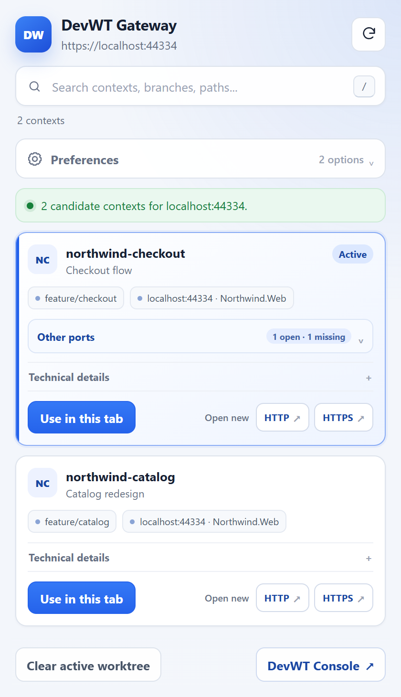

# DevWT

[](https://github.com/salihozkara/DevWT/actions/workflows/ci.yml)
[](LICENSE)

> [!WARNING]
> **AI-developed MVP preview:** The current DevWT codebase was written entirely
> by AI under human direction and validation. Features, behavior, installation,
> and update flows may change between preview releases. Code quality,
> architecture, maintainability, documentation, and test depth will continue
> to improve in future iterations.

DevWT is a Windows-first localhost isolation helper for developers who use Git worktrees.



DevWT assigns each registered worktree a deterministic localhost port range,
then uses a user-mode Win32 hook runtime to rewrite:

- TCP/UDP binds keep the requested IP and move only the port to that context's private backend range
- `localhost` URL configuration remains unchanged, including IPv4/IPv6 resolution and application-facing logs
- `connect(<ip>:<port>)` continues to target the original endpoint, where the gateway listens on the same IP and port
- child process creation so `node`, `dotnet`, `npm`, shell scripts, and IDE tooling inherit the hook before they bind

The gateway uses one owner worker per original IP and port, then proxies traffic to the right backend by request header, browser selection, process, session, image, fallback, or remembered routing state. Each worker image name contains the backend image name(s), so ordinary port/process inspection still identifies the application behind the virtual listener. Killing that worker is treated as a request to free the port: DevWT force-stops every virtual backend listener for the same IP and port and does not recreate the worker until those routes disappear.

## Status

This branch is the hook-core v1 line.

- User-mode Win32 hook runtime and localhost gateway.
- Worktree isolation without changing application-facing localhost URLs.
- Reliable path: start long-lived shells or apps through `devwt terminal` or `devwt run`.
- Best-effort path: the service watcher first uses Windows process-start events, then falls back to polling if the event session is unavailable. An unhooked process that binds immediately at startup can still beat the fallback path.

## Install

### Install the latest release

Download the bootstrap script, review it, and run it from PowerShell:

```powershell
Invoke-WebRequest https://raw.githubusercontent.com/salihozkara/DevWT/main/install.ps1 -OutFile .\install-devwt.ps1
powershell.exe -NoProfile -ExecutionPolicy Bypass -File .\install-devwt.ps1
```

The script selects the newest published release, including previews, downloads
the installer and its companion SHA-256 file, verifies the archive, and then
starts the bundled installer with elevation. It does not terminate applications
that already have an older DevWT runtime loaded.

To download and verify the installer without installing it:

```powershell
.\install-devwt.ps1 -DownloadOnly -Destination .\artifacts
```

### Build and install the preview

Requirements:

- Windows 10 or Windows 11, x64.
- An administrator account.
- Git for Windows.
- .NET 10 SDK, x64.
- Visual Studio C++ build tools.

Build the installer bundle from a normal PowerShell:

```powershell
dotnet restore .\Devwt.slnx
dotnet test .\Devwt.slnx --no-restore
powershell.exe -NoProfile -ExecutionPolicy Bypass -File .\installer\Build-DevWTInstallerBundle.ps1 -Configuration Release
```

Then open **PowerShell as Administrator** in `artifacts\installer\DevWT` and run:

```powershell
powershell.exe -NoProfile -ExecutionPolicy Bypass -File .\Install-DevWT.ps1
```

Open a new terminal after installation, then verify:

```powershell
devwt service status
devwt status
```

The Web Console is available at:

```text
http://127.0.0.1:17776/
```

The installer:

- Publishes the stable CLI entry point to `C:\Program Files\DevWT\app`.
- Stores each hook build under `C:\Program Files\DevWT\hooks\<version>` and
  records the active build in `app\hook-root.txt`.
- Adds `devwt` to Machine `Path`.
- Sets `DEVWT_STATE_ROOT` to `C:\ProgramData\DevWT`.
- Installs and starts `DevWTService`.
- Copies the Chrome/Edge extension to
  `C:\Program Files\DevWT\extension\devwt-browser`.

To load the browser extension:

1. Open `chrome://extensions` or `edge://extensions`.
2. Enable **Developer mode**.
3. Choose **Load unpacked**.
4. Select `C:\Program Files\DevWT\extension\devwt-browser`.

### Update an existing installation

The installed CLI can download the newest published release, verify its
SHA-256 checksum, and run the managed updater:

```powershell
devwt update
```

This is the safe default. It stages the new hook runtime for future processes,
briefly restarts `DevWTService`, and leaves applications that already loaded a
DevWT runtime running on their current version.

For a disruptive update that terminates those applications before selecting
the new runtime:

```powershell
devwt update --stop-running-applications
```

Terminated applications are not restarted automatically.

For a gateway, CLI, Web Console, or extension-only update that keeps the active
hook runtime and hooked applications running, open an elevated PowerShell in
the extracted release and run:

```powershell
powershell.exe -NoProfile -ExecutionPolicy Bypass -File .\Update-DevWTManaged.ps1
```

The managed updater stages service/CLI builds under
`C:\Program Files\DevWT\app-versions\<version>`, keeps the active hook build
and hooked applications intact, restores every live gateway endpoint, and
rolls back the service path if verification fails.

When a release changes the hook runtime, stage the new immutable hook for the
service and future processes without terminating currently hooked applications:

```powershell
powershell.exe -NoProfile -ExecutionPolicy Bypass -File .\Update-DevWTManaged.ps1 -UpdateHookRuntime
```

Existing applications keep their loaded hook until restarted. Use the full
`Install-DevWT.ps1` flow for an initial install, or the clean reinstall flow
when a deliberately disruptive replacement is required.

## Usage

Register a repo:

```powershell
cd C:\repos\my-app
devwt add
```

Register a repo with linked repos:

```powershell
cd C:\repos\my-app
devwt add --linked-repo shared-lib --linked-repo-path ..\shared-lib
```

Create worktrees normally:

```powershell
git worktree add C:\work\my-app-feature feature/demo
git -C C:\repos\shared-lib worktree add C:\work\shared-lib-feature feature/demo
```

Open a hook-enabled terminal in a worktree:

```powershell
cd C:\work\my-app-feature
devwt terminal
```

Or launch a process directly:

```powershell
cd C:\work\my-app-feature
devwt run -- dotnet run --project .\src\App
devwt run -- node .\server.js
```

For IDEs and launchers that start the real app as a child process, register the
IDE parent process with the background watcher. The IDE process keeps its own
localhost behavior, while child `dotnet`, `node`, apphost, and similar
processes are injected at creation time:

```powershell
devwt ide watch add --name Rider --path "$env:LOCALAPPDATA\Programs\Rider\bin\rider64.exe"
devwt ide watch add --name "Custom IDE" --path "C:\Tools\CustomIDE\custom-ide.exe"
devwt ide watch add --name Codex --app-id "OpenAI.Codex_2p2nqsd0c76g0!App"
devwt ide watch list
```

For Microsoft Store/MSIX apps, prefer `--app-id` or `--package-family` over a
`WindowsApps` executable path because Store updates change versioned install
folders. Use `Get-StartApps` to find the AppID.

This does not modify taskbar shortcuts, Start menu entries, file associations,
or IDE installations. It works regardless of whether the IDE was opened from the
taskbar, Explorer, a recent solution, or a file association.

The installed Git hook calls:

```powershell
devwt hook worktree-ready --repo-id <id> --path <worktree>
```

Open the Web UI:

```text
http://127.0.0.1:17776/
```

Useful commands:

```powershell
devwt status
devwt service status
devwt service start
devwt service restart
devwt update
devwt update --stop-running-applications
devwt cert status
devwt cert trust
devwt pause --repo my-app
devwt resume --worktree C:\work\my-app-feature
devwt context describe "Review authentication changes"
devwt context describe --worktree C:\work\my-app-feature "Review runtime code"
devwt context describe --clear
devwt port process --port 44334
devwt port process --port 44334 --context <context-id>
devwt port check --port 44334
devwt port check --port 44334 --context <context-id>
devwt remove
devwt remove --repo my-app
devwt link map --linked-repo shared-lib --source C:\work\my-app-feature --target C:\work\shared-lib-feature
devwt proxy target --context <context-id> --port 5025
devwt proxy context --context <context-id>
devwt proxy process target --pid <pid> --context <context-id>
devwt proxy process clear --pid <pid>
devwt proxy child stop --port 44334 --context <context-id> --protocol tcp
devwt proxy child kill --port 44334 --context <context-id> --protocol tcp
devwt proxy clear --port 5025
devwt proxy clear
devwt ide watch add --name Rider --path "$env:LOCALAPPDATA\Programs\Rider\bin\rider64.exe"
devwt ide watch add --name Codex --app-id "OpenAI.Codex_2p2nqsd0c76g0!App"
devwt ide watch list
devwt ide watch remove --name Rider
devwt shell install
devwt shell status
devwt shell uninstall
devwt gateway-cert status
devwt gateway-cert trust --machine
```

`devwt remove` removes the DevWT registration for the current git repository or
worktree. Use `devwt remove --repo <name-or-id>` when removing another repo
explicitly.

`devwt port process` reports the real backend listener process or processes for
an original port inside one context. Without `--context`, it resolves the
context from the current directory's longest registered worktree match. It
checks both TCP and UDP and ignores stale hook bindings that no longer have a
live listener. `devwt port check` performs the same lookup with script-friendly
exit codes: `0` when at least one application is listening, `1` when none is
listening, and `2` for invalid arguments or an unresolved context.

The Web UI manages:

- registered repos and linked repos
- searchable worktree contexts, descriptions, branches, runtime names, and observed ports
- pause/resume/remove actions
- one selected port at a time with its candidate contexts and TCP handling mode
- one fallback context for every port, or independent fallback contexts per numeric port
- `Callers` and `Timeline` routing activity views
- image, process, and session defaults for all ports or one observed port
- session-rule, runtime, and repository settings

`proxy context` selects one fallback context for all ports. `proxy target`
selects per-port mode and changes only the specified numeric port; TCP and UDP
share that selection. `proxy clear --port` removes one port selection, while
`proxy clear` clears the selection for the active fallback mode. Switching
modes preserves the inactive mode's selections so switching back restores them.

Browser-, process-, session-, and application-specific routing decisions take
precedence over these fallback selections.

When an original IP/port/protocol has only one eligible context, DevWT selects
it immediately with route reason `single-target`; no browser or fallback
selection is required.

### Activity and scoped defaults

Activity opens in `Callers` mode. Adjacent Image, Process, and Session lists
select one caller, while a single inspector shows that caller's scoped defaults
and newest requests without nested trees. `Timeline` shows the same bounded
200-entry history chronologically and has no routing controls. Search and
decision filters apply to both views, and the selected view is remembered
locally by the browser.

Each known image, process, or session can have one `All ports` context and
independent overrides for observed numeric ports. Choosing `Automatic` clears
only that exact scope. A per-port override wins over the all-port value at the
same scope. Unknown images, processes, and sessions are shown for diagnostics
but cannot receive scoped defaults.

Processes with the same configured session identity naturally route to a
listener started in that session when no stronger explicit target applies. This
lets an agent-started browser or helper reach applications from the same task
without a separate default for each child process.

Session rules can use process details or an environment value. Environment-only
rules are supported for launchers such as Codex that propagate a task identity
to child processes. Context inheritance remains separate: a child directory
that does not match a registered worktree does not inherit an unrelated parent
context.

## Browser Extension

DevWT includes a Chrome/Edge extension in `extension\devwt-browser`.
Use it in gateway mode when you want the browser URL and origin to stay on
`localhost` while switching the target context from the toolbar.

The extension does not redirect to a context IP or expose the shifted backend
port. It installs a tab-scoped active-worktree rule for HTTP, HTTPS, WebSocket,
and secure WebSocket requests to `localhost`, `127.0.0.1`, and `[::1]`. In extension
version `0.3.22`, a successful `Use in this tab` selection hard reloads that tab with
the HTTP cache bypassed and closes the popup. The popup offers two options,
both off by default: context tab grouping and a tab-title prefix using the
context description or, when absent, its Git ref. Changing a grouped tab's
context moves it to the matching group; disabling the title option or clearing
the selection restores the page title. Dragging a localhost tab into a
DevWT-created group selects that group's active context for the whole tab;
later localhost port changes keep following the group context. A failed
selection leaves the popup open with the error and does not reload the tab.
Tab and managed-group context links are stored persistently; browser startup
and extension updates recreate their tab-scoped rules and visual state. Records
remain pending until Chrome finishes restoring their tabs. Closing a Chrome
window preserves links for saved tab groups that can be reopened later.
The gateway removes
internal DevWT headers before forwarding to the target app, so application
request content stays natural.

The popup provides accent-insensitive search across context names, descriptions,
branches, IDs, worktree paths, and ports. Active contexts sort first and
technical details are expandable.
Each context card can also open a correctly selected new tab explicitly over
HTTP or HTTPS. The context list no longer has its own nested scrollbar.
When the same context listens on additional ports, the card exposes them under
`Other ports` with HTTP and HTTPS new-tab actions.
The active card also exposes ports that are missing locally but open in another
worktree of the same repository. Automatic, provider, and fail-closed choices
are persisted by DevWT for the active worktree plus natural port, so they apply
to every extension tab using that worktree. A newly started active listener
always wins. `Settings > Browser Missing-Port Fallback` is the default only
when that worktree/port has no policy. Effective redirects and
automatic fallback display a dismissible page notice without rewriting the
proxied HTTPS response.
`Automatic` forces DevWT's normal decision chain for that worktree/port even
when the Console default is off. `Console default` clears the worktree policy,
while `No redirect - stay here` forces a `502`. Missing-port selects stay open
during live status updates, save
without closing or reloading the tab, and the assigned context remains visible
as an Active card even when it is not listening on the tab's current port.
Open `Other ports` and technical-detail panels keep their state while live
status updates redraw the context cards.
Port labels include the short backend process name reported by DevWT, with PID
as a fallback when the process name is unavailable.

HTTP and inspected HTTPS requests run through an internal Kestrel host and the
YARP direct forwarder. Routing is evaluated for every request or HTTP/2 stream,
so keep-alive and multiplexed browser connections can switch context safely.
YARP preserves streaming requests, WebSockets, and gRPC.

Each TCP IP/port can use `Auto`, `HTTP Inspect`, `TLS Tunnel`, or `Raw`. `Auto`
inspects recognized HTTP/1.1 and cleartext HTTP/2, inspects TLS when the DevWT
gateway root is trusted for the machine, and otherwise preserves opaque TCP.
`HTTP Inspect` forces the Kestrel/YARP path, `TLS Tunnel` keeps TLS opaque while
still detecting cleartext HTTP, and `Raw` disables application-protocol detection.
Inspection uses the extension's tab-scoped `X-DevWT-Context` header, strips DevWT
headers, detects whether the selected backend uses HTTP or HTTPS, and reconnects
with the matching upstream transport. HTTP/1.1, HTTP/2 prior knowledge,
WebSockets, and gRPC are supported.
Inspected HTTP responses include `X-DevWT-Context`, `X-DevWT-Route-Reason`, and,
when configured, `X-DevWT-Description`.
The existing `devwt cert ...` commands remain
wrappers for `dotnet dev-certs`; `devwt gateway-cert ...` manages the separate
DevWT inspection certificate.

For development, open `chrome://extensions` or `edge://extensions`, enable
developer mode, and load `extension\devwt-browser` as an unpacked extension.
Installer bundles also include it under `extension\devwt-browser`.
After replacing files for an unpacked extension, press `Reload` once on the
browser's extensions page before testing the new version.

See the [visual tour](docs/visuals.md) for the missing-port workflow, Web
Console, architecture, and routing decision diagram.

## Development

```powershell
dotnet build .\Devwt.slnx
dotnet test .\Devwt.slnx --no-restore
powershell -NoProfile -ExecutionPolicy Bypass -File .\poc\hook-win32\Build-HookPoc.ps1
```

Set `DEVWT_HOOK_DISABLE=1` for DevWT management clients, browser helpers, or
diagnostics that must reach the host gateway directly from inside a hooked
terminal. The hook DLL stays loaded but stops bind/connect rewriting and child
injection for that process.

## Disclaimer

DevWT changes machine-level service, runtime, and localhost networking behavior.
Use it at your own risk. You are responsible for reviewing the software and its
scripts before use, maintaining appropriate backups, and any resulting impact
on your applications, development environments, data, or systems. The software
is provided under the [MIT License](LICENSE), without warranty.
