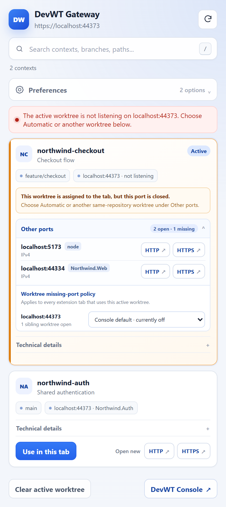
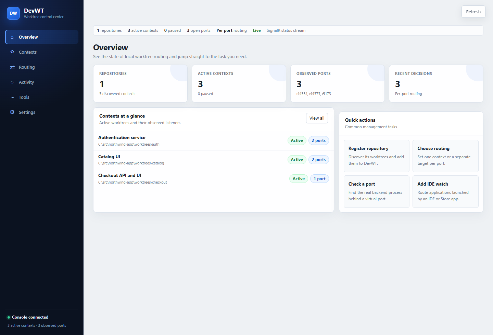
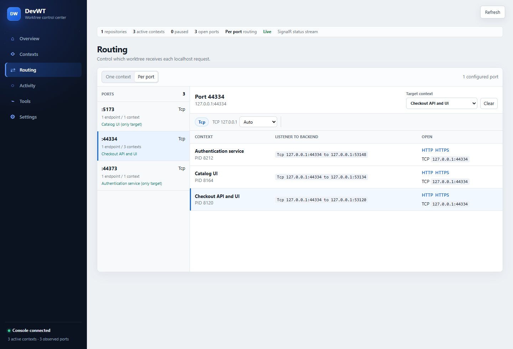

# DevWT Visual Tour

The screenshots use a fictional Northwind repository and contain no local
machine or private project data.

## Browser extension

The popup keeps the browser URL on `localhost` while making the selected
worktree and its available ports visible.

When the selected worktree does not listen on the current port, the popup shows
the available providers and the saved missing-port policy without hiding the
active context.

## Web Console

The Overview summarizes registered repositories, active contexts, observed
ports, and recent decisions.

Routing shows every context that owns a natural localhost port and the selected
target for that port.

## Architecture

## Routing decision

